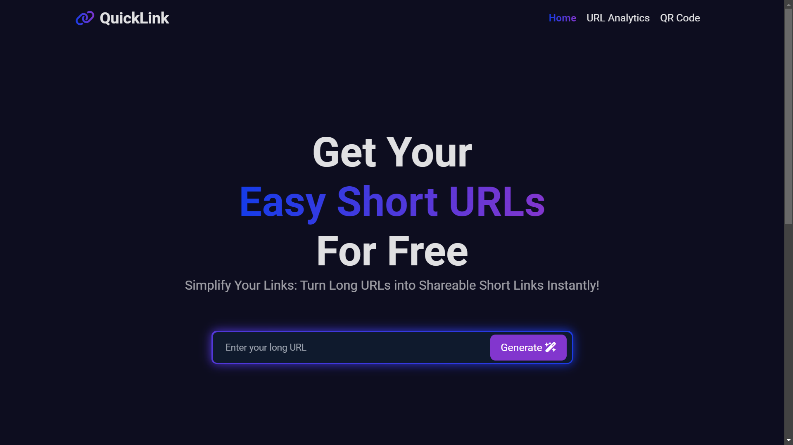
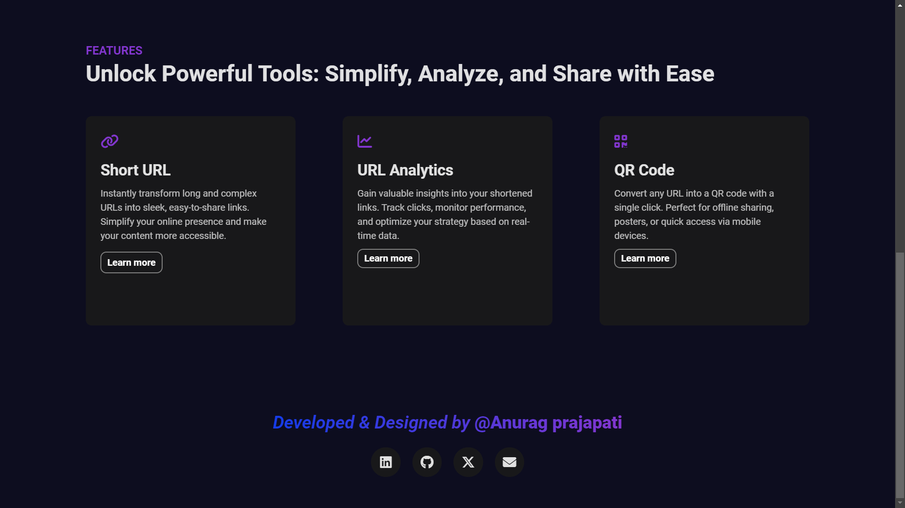
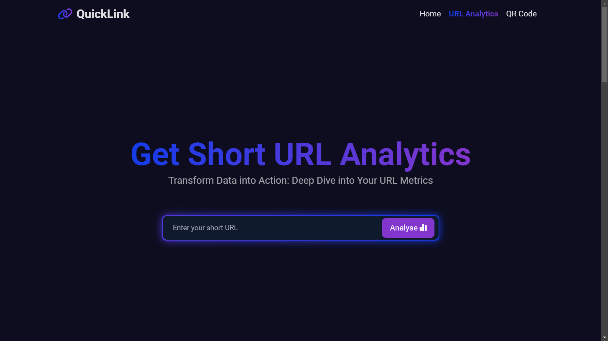
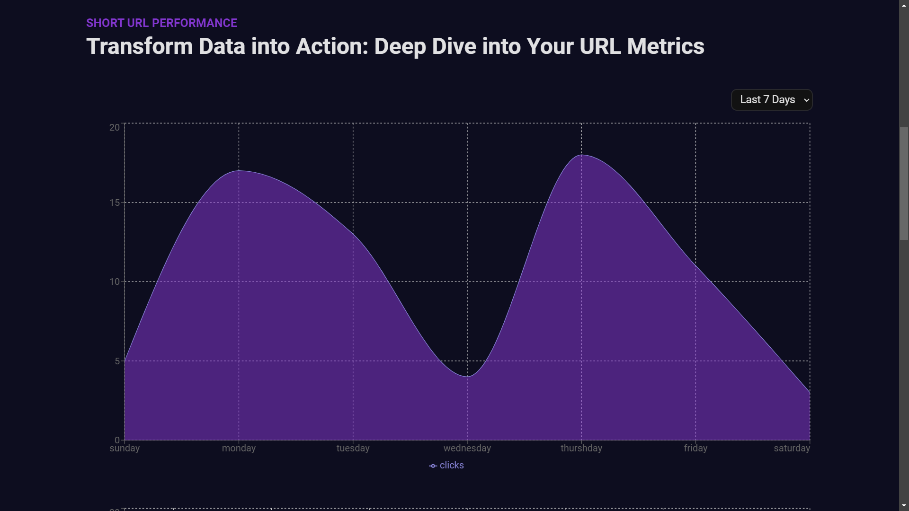
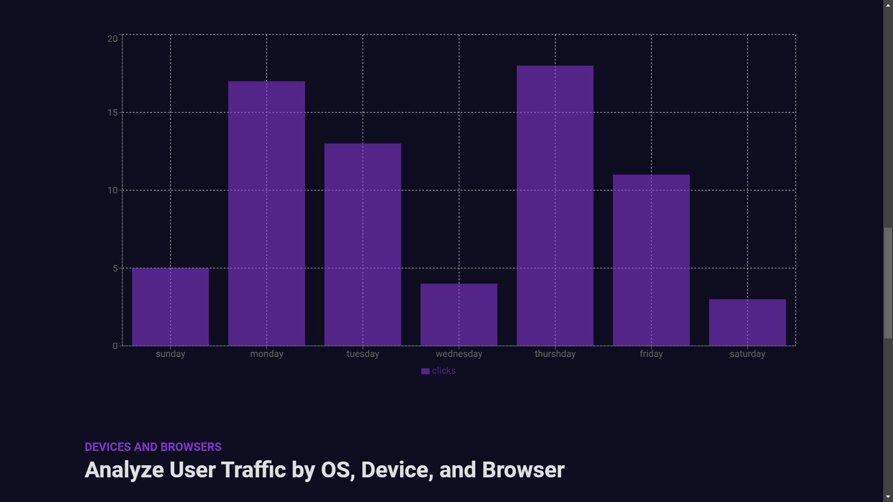
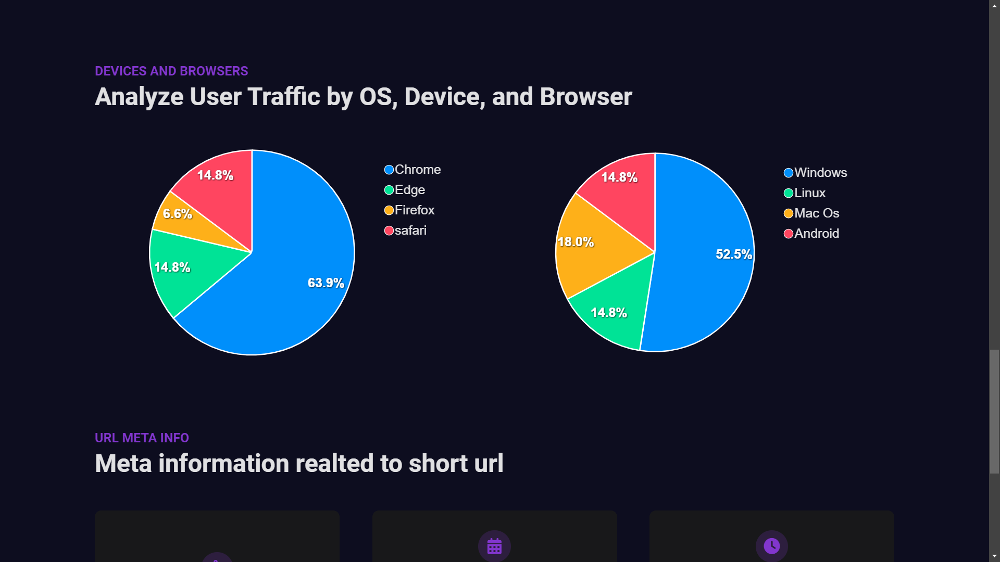
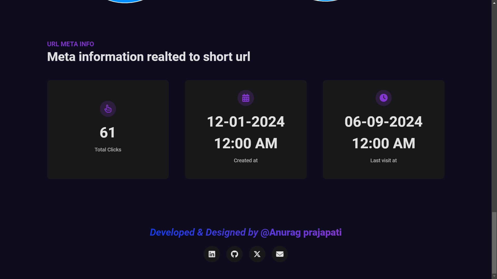
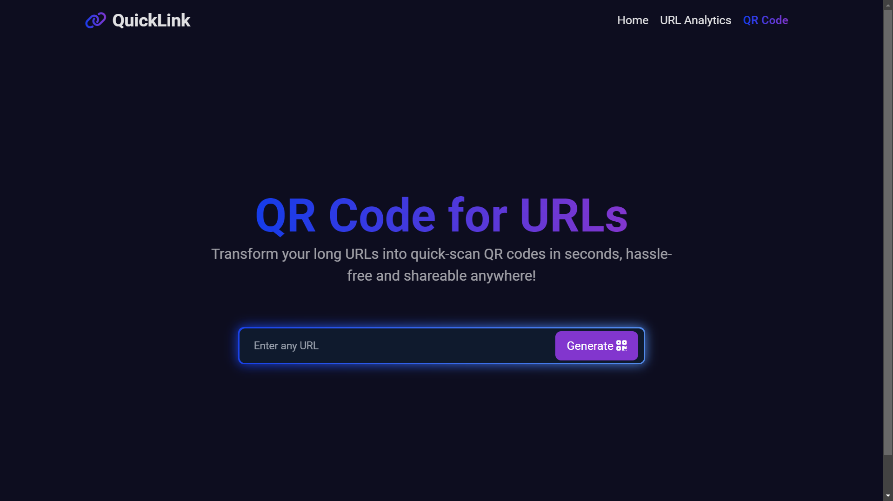
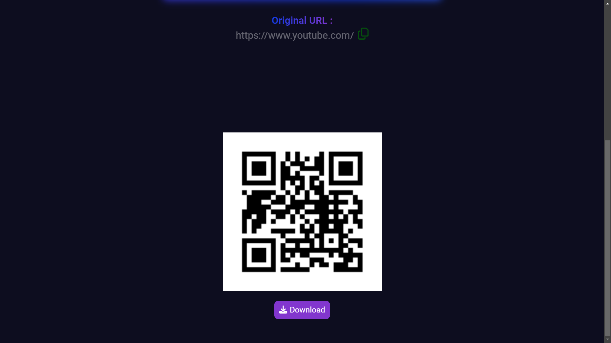

<h1>⚡ QuickLink - URL Shortener Web App</h1>

<strong>QuickLink</strong> is a powerful web app designed to shorten long URLs, generate QR codes, and provide comprehensive analytics about their usage. Built using modern technologies like <strong>React.js</strong>, <strong>Node.js</strong>, <strong>Express.js</strong>, and <strong>MongoDB</strong>, QuickLink makes managing your URLs easier, faster, and smarter!

<h2>✨ Features</h2>
<ul>
    <li>🔗 <strong>URL Shortening</strong>: Quickly shorten long and complicated URLs into easy-to-share, short links.</li>
    <li>📊 <strong>Analytics</strong>: Get detailed insights into who’s clicking your links—track clicks, devices, browsers, and operating systems in real-time.</li>
    <li>📅 <strong>Time-based Filters</strong>: View analytics by date ranges like today, last week, or even custom time periods.</li>
    <li>📱 <strong>QR Code Generation</strong>: Instantly generate a QR code for every shortened URL for easier sharing across devices.</li>
    <li>⚙️ <strong>Responsive Design</strong>: Optimized for use across all devices—whether it’s mobile, tablet, or desktop.</li>
</ul>

<h2>🚀 Tech Stack</h2>
<ul>
    <li><strong>Frontend:</strong> React.js, Tailwind CSS,Vanila CSS</li>
    <li><strong>Backend:</strong> Node.js, Express.js</li>
    <li><strong>Database:</strong> MongoDB</li>
    <li><strong>Version Control:</strong> Git, GitHub</li>
    <li><strong>Deployment:</strong> Render</li>
</ul>

<h2>🌟 Screenshots</h2>

<em>Caption: Home Page</em>

<em>Caption:Analytics page</em>

<em>Caption:QR Generation page</em>

<h2>🌐 Live Demo</h2>

Try out the <strong>live demo</strong> of QuickLink: <a href="https://quicklink-lfj0.onrender.com/" target="_blank">QuickLink Web App</a>

<h2>📞 Contact</h2>

Got questions? Feel free to reach out!

<ul>
    <li>📧 <strong>Email</strong>: <a href="mailto:your.email@example.com">your.email@example.com</a></li>
    <li>🔗 <strong>LinkedIn</strong>: <a href="https://www.linkedin.com/in/yourprofile/" target="_blank">Your LinkedIn</a></li>
    <li>🐙 <strong>GitHub</strong>: <a href="https://github.com/yourusername" target="_blank">Your GitHub Profile</a></li>
</ul>

</body>
</html>
